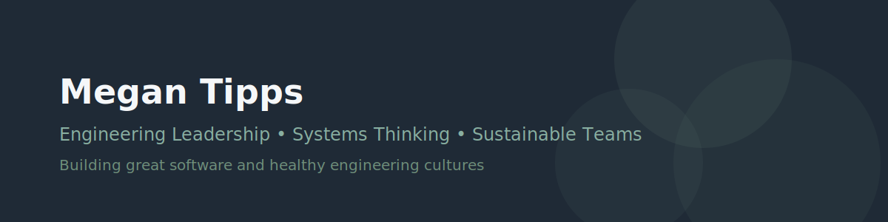

# Hi, I'm Megan 👋

I'm a **software engineer turned engineering leader** who still loves to write code.

I care deeply about building **great products, healthy engineering teams, and sustainable tech careers.**

> Great engineering teams are built with equal parts  
> **technical excellence and empathy.**

## ⏱ Coding Activity

## 🌱 About Me

- Engineering leader and hands-on developer
- Writing about dev culture and leadership
- Passionate about sustainable ambition in tech
- Building better systems *and* better teams

## 🔗 Links

## 🛠 Tech Stack

### Frontend

### Backend

### Databases

### Infrastructure

## 🚀 Current Focus

Right now I'm focused on:

- Building **developer tools and SDKs**
- Modernizing **legacy platforms**
- Designing **API-first architectures**
- Creating **healthy, sustainable engineering teams**

## 🌟 Featured Work

Some areas I spend a lot of time building in:

**Developer SDKs**  
Private Flutter SDKs used by partners to integrate into product platforms.

**Analytics Platforms**  
Self-hosted data stacks using **Metabase, Docker, and Cloud infrastructure**.

**Modernizing Legacy Systems**  
Helping teams transition older platforms to modern stacks like **Vue + NestJS**.

## ✍️ Latest Writing

<!-- BLOG-POST-LIST:START -->
- [Why You Can’t Rush a Team That Needs Time to Grow](https://www.leadingwithempathy.blog/why-you-cant-rush-a-team-that-needs-time-to-grow/)
- [People Don’t Burn Out Because They’re Weak — Why Caring Too Much Leads to Burnout at Work](https://www.leadingwithempathy.blog/people-dont-burn-out-because-theyre-weak-why-caring-too-much-leads-to-burnout-at-work/)
- [Leadership Burnout Is Real: You Can’t Lead Well If You’re Running on Empty](https://www.leadingwithempathy.blog/leadership-burnout-is-real-you-cant-lead-well-if-youre-running-on-empty/)
- [Workplace Happiness Isn’t Comfort: What Truly Makes Teams Happy](https://www.leadingwithempathy.blog/workplace-happiness-isnt-comfort-what-truly-makes-teams-happy/)
- [High Standards Shouldn’t Mean High Anxiety: Building Ambitious Teams Without Burnout](https://www.leadingwithempathy.blog/high-standards-shouldnt-mean-high-anxiety-building-ambitious-teams-without-burnout/)
<!-- BLOG-POST-LIST:END -->

I write about:

- Engineering leadership
- Developer culture
- The journey from developer to CTO
- Sustainable ambition in tech

📖 Blog:  
https://www.leadingwithempathy.blog

## ⚡ Fun Facts

- My best architecture ideas happen while walking the dogs
- I enjoy debugging complex systems more than simple ones
- Coffee improves code quality by **at least 37%**

## 📫 Connect With Me

Blog: https://www.leadingwithempathy.blog  
LinkedIn: https://linkedin.com/in/megantipps
